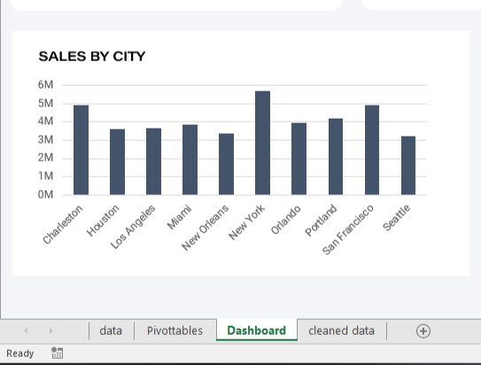

# Adidas Store Sales Analysis 


## Introduction
This is a Microsoft Excel dashboard project on sales analysis of an imaginary brand company called **Adidas Store**. 
The dataset contains sales data of 9,648 customers of **Adidas Store** who place orders from year 2020 to 2021 in United States of America, including the invoice date, retailer, states, region, city, product, price per unit, total revenue, and sales method.

My goal in this project to help stakeholder etc to have insight about customer demographics, product performance, revenue made and sales channel performance to enable **Adidas Store** to make profitable data-driven decisions.

**_Disclaimer_**:- _All datasets and reports do not represent any company, institution or country, but just a dummy dataset to demonstrate capabilities of Microsoft Excel._

## Problem Statements
The following business questions have been presented to enable the marketing team at **Adidas Store** to understand the sales which were made in 2020 to 2021.

1. Which products conttribute more to the revenue?
2. Which states and city should we push more products?
3. What is the peak month for sales in 2020 and 2021?
4. Which sales methods are performing well?

## Microsoft Excel skills/concepts demonstrated 
- Data cleaning
- Excel formulas (DATE, SUM etc)
- Cell referencing
- Pivot tables
- Slicers
- Data visualization
- Dashboard buiding

## Data Cleaning
- The dataset was imported into Microsoft Excel using the **Get data** option in the data tab. Here is how I cleaned the data.
- Column datatypes were validated appropriately  – E.g. revenue column was formatted to have currency format.
- To change the Invoice Date column, Invoice Date which was on in number data type, to the ‘date’ data type, a new column was created, and the formula below was used to fill the new 
  column with the data that can be changed to the date data type.
  
  ```html
  =DATE(YEAR(C2), MONTH(C2), DAY(C2))
  ```
- The cell reference ID, `C2` contains the Invoice Date record in the original column. The formula converts the number in cell C2 to a date format and column `Invoice_Date` was created. 
  The rest of the rows were auto-filled by Excel accordingly.

  | Unformatted Date | Formatted Date |
  | ---------------- | -------------- |
  |  |  |

## Data findings and visualizations 
### Which products contribute more to the revenue?
The products that generated the highest revenue are Street Footwear and Apparel.


From the result above, we see that the Street Footwear contributed amounting to $44,882,332 as a revenue and followed by Apparel

### Which region and city should we push more products?
West and Northeast have the highest, recording a total of `$61,514,424` while New York, Charleston and San Francisco city have the highest revenues of a total of `$15,509,652`

  | Slaes by Region | Sales by City |
  | ---------------- | -------------- |
  |  |  |

### What is the peak month for sales in 2020 and 2021?
JULY is a peak month for 2020 and 2021 with **$12,550,419**.


### Which sales methods are performing well?
A large number of customers that purchases products from Adidas Store uses Online method to buy products and very few number few number of customers uses In-store method.


## Dashboard Overview
The project dashboard contains a Microsoft Excel worksheet, pivot tables overview of the analysis. It was created to provide insights and dynamic answers to business questions posed during the analysis


You can interact with the dashboard here

## Conclusions/Recommendations
- The total revenue generated by Adidas Store was **$120,166,650**.
- Street Footwear & Apparel products are the best-selling products from 2020 to 2021.
- Offering promotions and discounts can be used to attract new customers and increase sales.
- The high rate of Online Sales purchases indicates that Adidas Store has more online customers than others.
- The total number of quantity sold on Adidas Store was **2,478,861**.


